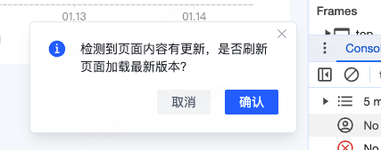

### 使用场景

背景: 当一些高频使用的网站发布新版本时，往往不能在短时间内覆盖到平台上 80%及以上的用户，此时，用户无法知晓当前网站是否有更新。

### 弹窗触发条件

本地版本 vs 云版本 不一致时触发

### 触发时机

切换路由 （点击导航或者 tab 页切换）

### 使用

在使用这个库时需要引入两个部分：`vite` 插件 和 弹窗组件

`vite` 插件: 主要功能是在构建时在生成云端版本 `version.js` 和 在 `index.html` 注入本地版本号，通常是标签 `id` 为 `domId` 的标签

🌰

```html
<div id="version" style="display: none">1705302316059</div>
```

弹窗组件: 主要功能是在屏幕右下角生成弹窗,并在 `localStorage` 生成并存储过期时间：`versionInfoExpireTime`



#### 安装

```bash
npm i @lymtic/version-watcher
```

#### 插件引入

在 vite.config.ts 引入

```ts
import { publishVersion } from '@lymtic/version-watcher/vite'

// https://vitejs.dev/config/
export default defineConfig({
  plugins: [
    publishVersion({
      domId: 'lymtic-version-watcher' // 可选参数，可以不传
    })
  ]
})
```

插件需要配合组件使用，在传递 domId 时，需要保持一致

#### 样式引入

```ts
// main.ts
import '@lymtic/version-watcher/style.css'
```

#### 组件引入

在根组件 App.vue 引入组件

```vue
<script setup lang="ts">
import { FeVersionWatcher } from '@lymtic/version-watcher'
</script>

<template>
  <div>
    <FeVersionWatcher></FeVersionWatcher>
  </div>
</template>
```

FeVersionWatcher 组件接收 props

props 都是可选属性，不传递时使用默认属性

```ts
type expirationType = '1d' | '30min'

interface PropsType {
  modelDomId?: string // 渲染的弹窗的id
  desc?: string // 弹窗内容
  expiration?: expirationType // 缓存时间，默认一天只显示一次
  showModal?: boolean //是否显示弹出案，false时直接触发刷新，不显示弹窗
  domId?: string // 页面上存储的版本号元素的id ,需要与 vite 插件传递的参数保持一致，也可以都不传递，使用默认值
}
```

#### demo 地址

```bash
https://github.com/HamsterCat-W/fe-version-watcher-demo
```
